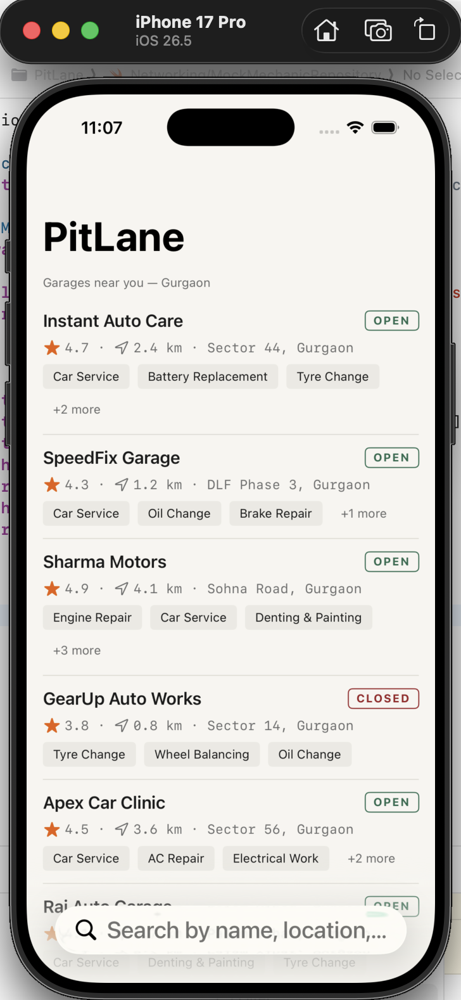
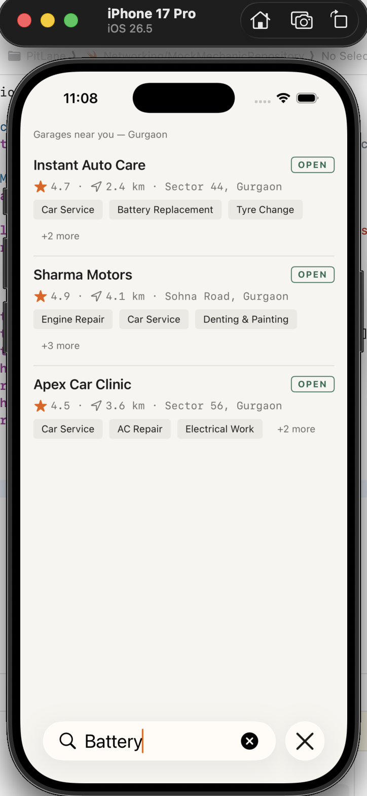
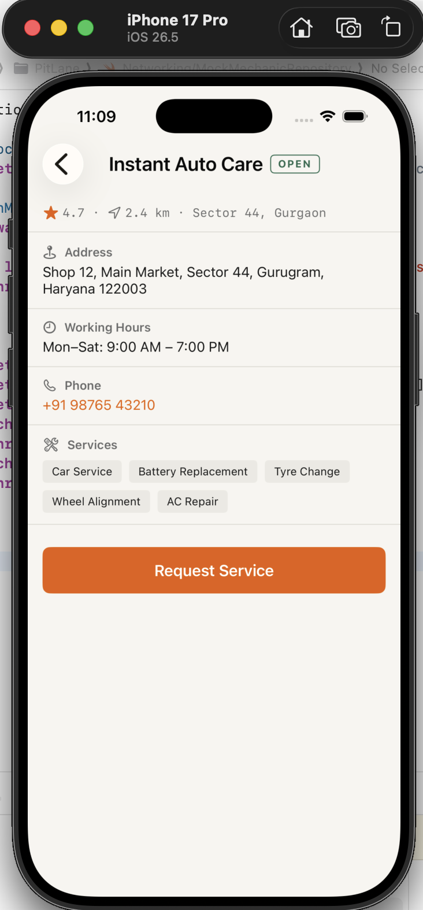
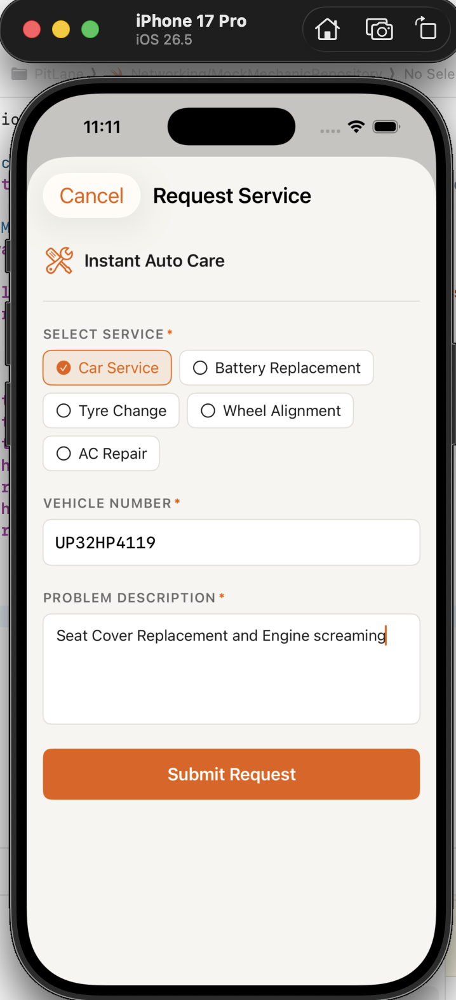
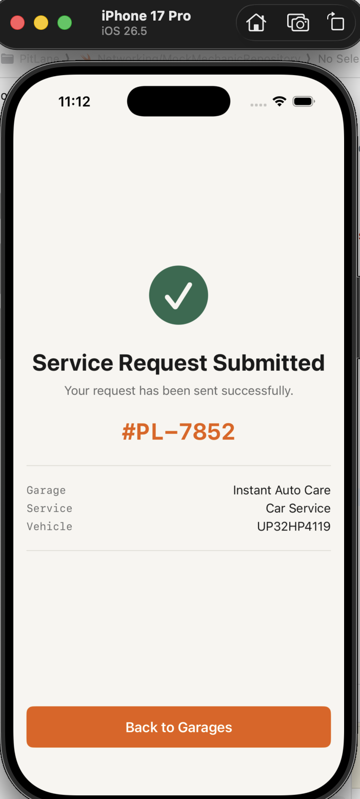
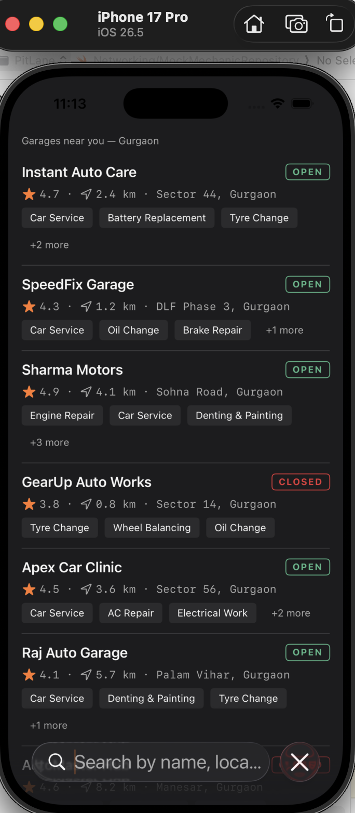

# PitLane — Instant Mechanic Booking App

**PitLane** is a SwiftUI iOS 17+ mechanic directory and instant service booking app tailored for Gurgaon, built with a **Workshop Ledger** visual design identity.

---

## 🏎️ Product Concept & Visual Metaphor

PitLane reimagines garage discovery without generic card stacks, floating shadows, map clones, or hero gradients. Instead, it adopts a **Workshop Ledger** visual language:

- **Full-Width Ledger Rows**: Separated by crisp 1pt hairlines (`#E0DDD6` in light mode, `#3A3A3C` in dark mode).
- **Monospaced Metadata Rail**: Rating, distance in kilometers, and sector displayed in `SF Mono` for clean alignment.
- **Stamp-Style Status**: `OPEN` (green border) and `CLOSED` (red border) status stamps reminiscent of physical workshop logbooks.
- **Color Palette**: Warm paper background (`#F7F5F0`), workshop orange accent (`#E85D04`), with adaptive support for Dark Mode (`#1C1C1E`).
- **Work Order Sheet**: Requesting service presents a structured sheet form with single-service selector, Indian vehicle registration plate validation, and issue description.

---

## 🏗️ Architecture

The app uses **MVVM + Repository Pattern + Lightweight Dependency Injection (DI)** built exclusively with native SwiftUI and Swift 5.10 / iOS 17+ features.

```
PitLane/
├── App/
│   ├── PitLaneApp.swift          # App entry point with @main
│   └── AppDependencies.swift     # DI container injected via SwiftUI Environment
├── Models/
│   ├── Mechanic.swift            # Codable, Identifiable, Hashable garage model
│   └── ServiceRequest.swift      # Work order submission model & reference ID generator
├── Networking/
│   ├── MechanicRepository.swift  # Protocol for data fetching
│   ├── MockMechanicRepository.swift # Bundled JSON loader with 0.8s simulated latency
│   └── APIError.swift            # Typed LocalizedError with user-friendly messages
├── ViewModels/
│   ├── HomeViewModel.swift       # State management, search filtering, pull-to-refresh
│   └── RequestServiceViewModel.swift # Form validation, regex check, simulated async submit
├── Views/
│   ├── Home/
│   │   └── HomeView.swift        # Ledger directory list, skeleton loader, error state, search
│   ├── Detail/
│   │   └── MechanicDetailView.swift # Facts section, phone link, tag row, CTA state
│   ├── Request/
│   │   └── RequestServiceView.swift # Sheet form with vehicle regex and service selector
│   ├── Confirmation/
│   │   └── ConfirmationView.swift # Success checkmark, reference ID ticket, pop-to-root
│   └── Components/               # 12 modular reusable UI components
│       ├── LedgerDivider.swift
│       ├── StatusStamp.swift
│       ├── RatingDistanceLine.swift
│       ├── ServiceTagRow.swift
│       ├── MechanicLedgerRow.swift
│       ├── PrimaryButton.swift
│       ├── LoadingSkeletonView.swift
│       ├── ErrorStateView.swift
│       ├── FormSectionLabel.swift
│       ├── ServiceSelector.swift
│       ├── VehicleNumberField.swift
│       └── MultilineTextField.swift
├── Resources/
│   ├── mechanics.json            # 7 realistic Gurgaon mechanics
│   └── Assets.xcassets           # Adaptive Light/Dark Mode color tokens & AppIcon
└── Theme/
    └── Theme.swift               # Design system tokens (typography, colors, spacing)
```

---

## 📱 Key Features & Edge Case Handling

1. **State Management**:
   - **Skeleton Shimmer Loading**: Displays 3 animated skeleton ledger rows on initial fetch.
   - **Error Handling & Retry**: Displays full-screen `ErrorStateView` with typed error message and retry action.
   - **Search & Filter**: Real-time searching across garage name, location/sector, and offered services with an empty state display.
   - **Pull to Refresh**: Built-in `.refreshable` modifier re-triggers mock repository fetching.

2. **Closed Mechanic Flow**:
   - Garages marked `isOpen: false` show a distinct `CLOSED` stamp.
   - Primary CTA on detail view is disabled with an explanatory inline banner: *"This garage is currently closed."*

3. **Form Validation**:
   - **Vehicle Registration Plate Validation**: Validates Indian vehicle number formats against regex `^[A-Z]{2}\d{2}[A-Z]{1,2}\d{4}$` (e.g. `HR26AB1234`).
   - **Service Selector**: Dynamically filtered to only show services offered by the selected mechanic.
   - **Description Requirement**: Requires minimum 10 characters before form submission is enabled.
   - **Async Submit State**: Shows `ProgressView` spinner on primary button with disabled state, handling alert on simulated network errors.

4. **Navigation & Confirmation**:
   - Uses `NavigationStack` with `NavigationPath`.
   - On request submission, confirmation screen displays an animated checkmark and ticket reference ID (e.g. `#PL-4829`).
   - "Back to Garages" pops navigation path directly back to root directory.

---

## 🔌 Data & Repository Layer

Data is loaded asynchronously via `MechanicRepository` protocol:

```swift
protocol MechanicRepository: Sendable {
    func fetchMechanics() async throws -> [Mechanic]
}
```

The bundled `MockMechanicRepository` decodes `mechanics.json` with `Task.sleep(nanoseconds: 800_000_000)` to simulate real-world network latency.

### API / Data Source

For this assignment, the app uses a **bundled mock JSON endpoint** (`mechanics.json`) through `MockMechanicRepository`. The repository is abstracted behind `MechanicRepository`, so it can be replaced with a real `URLSession` REST implementation without changing the UI or ViewModels.

Service submission is also simulated asynchronously for demo purposes; no real booking backend is used.

### Typed Error Model (`APIError`)
- `.networkFailure` → User message: *"Unable to connect. Please check your internet connection..."*
- `.decodingError` → User message: *"We received unexpected data. Please try again later."*
- `.fileNotFound` → User message: *"The requested data could not be found."*
- `.serverError(statusCode)` → User message: *"Server error (X). Please try again later."*

---


## 📸 App Screenshots

### Home — Mechanic Directory


### Search & Filtering


### Mechanic Details


### Request Service


### Confirmation


### Dark Mode


> The screenshots demonstrate the main user journey, responsive states, form validation flow, and the Workshop Ledger visual system.

## 🤖 AI Usage Disclosure

This application was developed using **Google Antigravity** as a pair programmer:
- **Architectural Scaffolding**: Antigravity generated the initial blueprint, directory hierarchy, Xcode `.pbxproj` structure, and mock JSON schema.
- **Component Development**: Component interfaces and SwiftUI layouts were co-authored with Antigravity following strict "Workshop Ledger" visual specs.
- **Verification**: Code compilation and build validation were executed using `xcodebuild` targeting `iphonesimulator` within the sandbox.
- **Manual Verification**: The app was run in the iOS Simulator and the main flows, loading/error states, retry behavior, validation, dark mode, text-size accessibility behavior, search, refresh, and confirmation flow were manually verified.

---

## 🎯 Assumptions

1. **Local Scope**: Target area is Gurgaon, Haryana (DLF, Sohna Road, Sectors 14/44/56, Palam Vihar, Manesar).
2. **Mock Persistence**: Requests generate an in-memory `ServiceRequest` reference ID; no local database (CoreData/SwiftData) is required for demo scope.
3. **No 3rd-Party Dependencies**: Native Foundation & SwiftUI components only (no CocoaPods, SPM packages, or external UI libraries).

---

## 🔮 Future Improvements

- **Unit & UI Tests**: Add `XCTest` coverage for `HomeViewModel`, `RequestServiceViewModel`, and `VehicleNumberField` regex validation.
- **Live Network Layer**: Add `LiveMechanicRepository` using `URLSession` to connect to a real backend REST API.
- **Map View Integration**: Add MapKit preview sheet for directions to selected mechanic.
- **Booking History**: Local persistence via SwiftData to view past request slips and ticket statuses.
